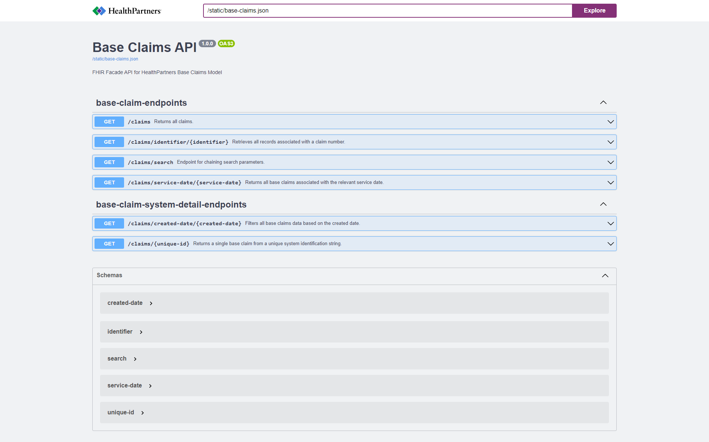
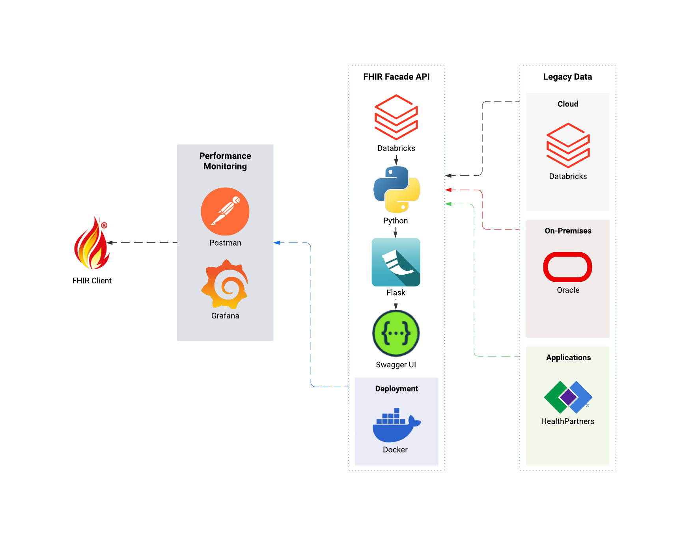

# fhir-facade-api

## description

A repository featuring a healthcare data project focused on creating an API endpoint to serve data to HealthPartners third-party vendors.

## project

### FHIR Facade API & DevDays Presentation

- **Description:** An API project designed to transform healthcare data into the HL7 FHIR specification format as an ETL pipeline.

- **Goal:** Create a DevDays presentation showing the most efficient way to develop an end-point for third-party vendors to access corporate data.

- **Tools:** Python, Flask, Swagger, Docker, Oracle

- **File(s):** fhir-facade-api (Folder)

## user interface

# architecture

